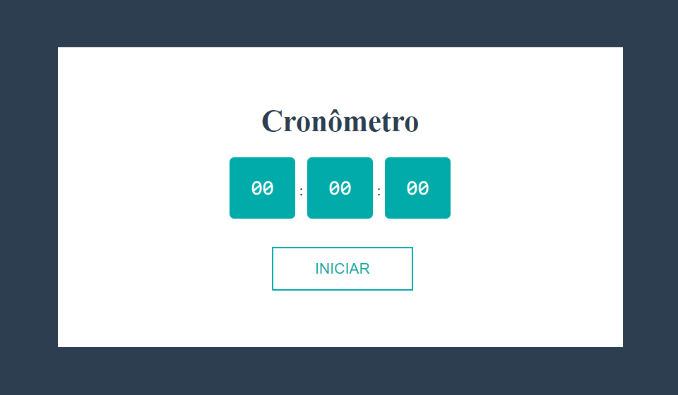

<!-- VARS -->
[live-demo-url]: https://chap0lin.github.io/cronometro/
[stopwatch-url]: https://github.com/codingWithElias/react-stopwatch
<!-- VARS -->
<h1 align="center">
    Cronômetro
</h1>

    

## :memo: Descrição
Aplicação simples de um cronômetro.

## :rocket: Como usar
Para testar a aplicação basta acessar o [link][live-demo-url]. 

## :gear: Processo
### :zap: Motivação:
Nas minhas aventuras de fazer joguinhos eu estou tento que constantemente fazer timers. Decidi fazer um projeto apenas de cronômetro pra usar como referência sempre que eu for fazer um novo timer. Nesse projeto eu me baseei no projeto de ([CodingWithElias][stopwatch-url])
Apaixonado por música decidi começar a produzir alguns beats e tentar recriar algumas músicas utilizando um DAW (Digital Audio Workstation). No DAW que eu utilizo não existe essa ferramenta e eu me encontrava constantemente utilizando ferramentas online ([Ex1][all8-url], [Ex2][bpmOnline-url]). Então decidi fazer uma minha.